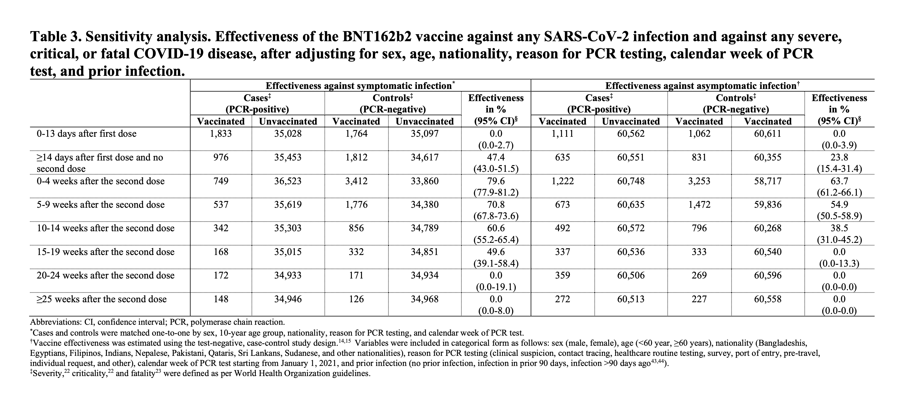

```{r setup, include=FALSE}
library(knitr)
```

> To boost or not to boost. That is the question.

## The Waning Problem
Recent reports have indicated potential "waning" of vaccine protection against COVID-19, especially in BNT162b2 [@chemaitelly2021WaningBNT162b2].

```{r, echo=FALSE, layout="l-body-outset"}

```

This is in tandem with reports of declining neutralizing titer.

### Vaccine Efficacy

All of the reports so far have suggested that major vaccine efficacy decreases occur only in protection against infection, both asymptomatic and symptomatic, but not for hospitalization and death.

## Are boosters the solution?

The answer depends strongly on our end goal and limits in vaccine supply.

### Constrained Supply

Ethics direct that we should direct the vaccines toward the people who would benefit the most, that is, those in middle- and low-income countries.

### Unconstrained Supply

In this case, we need to conduct a cost-benefit analysis, especially in light of reports of myocarditis in young adults [@verma2021MyocarditisCovid19]. Can the potential increase in protection against "mild" infection outweigh the risks?

## Conclusion

